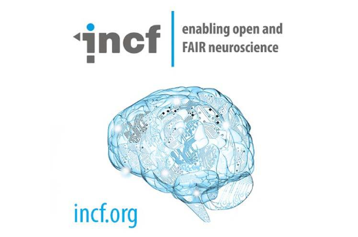

  
  &nbsp;&nbsp;&nbsp;
  
  &nbsp;&nbsp;&nbsp;
  

# Refactoring Synaptic Behavior in HNN-core

**Project:** Refactoring Synaptic Behavior in HNN-core

**Organization:** [INCF](https://incf.org/) - [Human Neocortical Neurosolver (HNN)](https://hnn.brown.edu/)

**Repository:** [jonescompneurolab/hnn-core](https://github.com/jonescompneurolab/hnn-core)

## GSoC Contributor

**Name:** Satvik Saluja

**Email:** [satviksaluja2507@gmail.com](mailto:satviksaluja2507@gmail.com)

## Mentors

**Mentors:** Katharina Duecker (Primary mentor), Nicholas Tolley, Austin Soplata, Anna Cattani

## 1. Introduction

The Human Neocortical Neurosolver (`HNN-core`) is a user-friendly Python API for biophysically detailed neural modeling, designed specifically for researchers studying EEG and MEG signals without requiring extensive computational backgrounds.

This project set out to refactor how HNN-core places and represents synapses in its network model. At the start of the summer, every cell had a synapse built at the same fixed, hardcoded location regardless of whether a connection actually used that location, and there was no way to place a synapse anywhere else. The underlying goal was to make synapse placement flexible enough to eventually support realistic, probabilistically distributed connectivity along a cell's dendrites, which the broader scientific use case behind this project depends on.

What began as a fairly contained task - stopping the creation of synapses nobody uses - kept revealing a larger problem underneath it: placement needed a real data structure, that structure needed to stay in sync with the network's connectivity, and keeping two things in sync turned out to be hard enough that the connectivity representation itself needed to change. *Hofstadter's Law* - "It always takes longer than you expect, even when you take Hofstadter's Law into account" - is a fair summary of how the scope of this project unfolded.

Each section below narrows in: first the outcomes achieved, then the technical timeline of how the design got there, including the iterations that were tried and set aside along the way.

## 2. Final Outcome

Over the course of GSoC, the project evolved from reducing unnecessary synapse creation into a broader redesign of how HNN-core represents and places synapses.

- **Reduced unnecessary synapse creation:** the default network created 6,610 synapse objects even though many sections were never targeted by a connection. Restricting creation to sections with active synapses reduced this to 3,810 synapses, while preserving the simulated dipole output exactly, and substantially cut memory usage. The later move to a DataFrame-based connectivity representation brought this down further to 1,940 synapses.

- **Implemented configurable synapse placement:** introduced `seg_x` so connections and drives can request a specific location along a section instead of being restricted to the hardcoded midpoint (`0.5`). Traced through the network-building pipeline and verified end-to-end.

- **Investigated how NEURON maps synapse locations:** traced how NEURON discretizes sections into segments and confirmed that a requested continuous `seg_x` is automatically mapped to the nearest valid segment center (e.g. `0.99` maps to `0.944` on a 9-segment section), so HNN-core can accept flexible continuous locations without users manually calculating valid segment coordinates.

- **Developed and tested synapse-tree representations:** explored several designs, including section-, source-, and target-oriented structures, configurable segment locations, multi-segment placement, and reusable cell-type templates. These iterations exposed synchronization and data-modeling issues that informed the eventual architectural redesign.

- **Moved toward a single source of truth for connectivity:** the repeated risk of a synapse tree drifting out of sync with `net.connectivity` motivated the transition toward a DataFrame-based connectivity representation, with one row per synaptic connection and its associated placement and receptor information.

- **Implemented and validated the initial DataFrame connectivity path:** tested against the existing implementation using synapse counts, NetCon counts, and numerical dipole comparisons, catching and correcting several subtle bugs, including a deduplication key error that initially doubled the expected synapse count.

- **Improved HNN-core path handling:** separately contributed a migration from `os.path` to `pathlib` across HNN-core, submitted as a PR and merged.

- **Established the path for future probabilistic synapse placement:** designed a representation of synapse locations as probability distributions over distances from the soma. Implementation was scoped as post-GSoC work, building on the more structured connectivity representation developed during the project.

The result is not a single isolated feature, but a progressively validated foundation for more flexible and biologically realistic synapse placement in HNN-core.

## 3. Pull Requests

Four pull requests to HNN-core reflect the work above:

| PR | Description | Status |
|---|---|---|
| [#1311 - MIGRATE os.path utilities to pathlib](https://github.com/jonescompneurolab/hnn-core/pull/1311) | Migrated `os.path`-based path handling to `pathlib` across HNN-core. | ✅ Merged |
| [#1316 - Implement Synapse creation at every Segment](https://github.com/jonescompneurolab/hnn-core/pull/1316) | Exploratory PR implementing synapse creation at every segment (~34,610-synapse iteration); used to benchmark cost, not intended to land. | Closed (exploration) |
| [#1319 - Place synapses only on sections targeted by connectivity](https://github.com/jonescompneurolab/hnn-core/pull/1319) | Restricted synapse creation to sections actually targeted by connectivity (3,810-synapse iteration); groundwork for the main PR. | Closed (superseded by #1322) |
| [#1322 - Second approach: segment location](https://github.com/jonescompneurolab/hnn-core/pull/1322) | Main GSoC PR - segment-location parameterization, synapse-tree iterations, and the `net.connectivity` DataFrame refactor (80 commits as of writing). | 🚧 Open - expected to merge post-GSoC |

> **A note on PR #1322's status:** this PR remains open rather than merged because its scope grew
> substantially in mid-to-late August, when design review concluded `net.connectivity` itself needed
> to move from a dictionary to a DataFrame - a considerably larger change than the segment-location
> work the PR started as. Landing that safely requires thorough compatibility testing against the
> existing dictionary-based path and further review before merging, rather than rushing a structural
> data-model change into main. The scope increase is why it's expected to merge post-GSoC, not
> because the work is incomplete.

## 4. Remaining Work

- Decide how the DataFrame is saved in network configuration files, and how it should be reconstructed from stored configurations.
- Implement the single update function covering both representations, and its consistency check.
- Replace the one remaining dictionary-dependent code path (cell-specific drive GID assignment) with a DataFrame-based equivalent.
- Carry the probabilistic/distance-based template design forward into an implementation on top of the DataFrame-based connectivity representation.
- Create tutorial scripts showing how users can inspect, filter, query, and modify the connectivity DataFrame.

I've been invited to continue contributing to this project as a volunteer after the GSoC coding period ends, and intend to keep working through this list. Realistically, the full migration is not expected to land in the main codebase before October, and I'd like to see it through rather than hand it off mid-migration.

<b>5. Technical Timeline (click to expand)</b> - month-by-month account of the design iterations, dead ends, and pivots

This section walks through how the outcomes above were arrived at, month by month, including the iterations that were tried and later revised or abandoned. It is included because the reasoning behind each pivot is useful to a future contributor working on the same part of the codebase.

### 5.1 Late May – Early June: Learning the System

Before changing anything, the best decision I made all summer was to slow down and build a whimsical workflow diagram of HNN-core's execution flow before writing any code. It forced me to trace the logic end-to-end rather than skim it, and nearly every design decision later in the project traced back to something I'd first understood while sketching that map. That groundwork also included tracing how the number of segments in a section (`nseg`) is decided, and submitted to NEURON's own C++ source to find the exact formula it uses to position a segment along a section, which wasn't obvious from the Python side. For a section with N segments, the i-th segment sits at `(i + 0.5) / N`. I verified this by hand for several odd values of N and then confirmed it empirically against the actual segment positions NEURON reported back.

### 5.2 Early June: Three Iterations on How Synapses Get Created

The first concrete task was to establish how many synapse objects the default network was creating, and whether that number was higher than it needed to be. This went through three distinct iterations.

**Iteration 1 - Baseline.** Every cell type created exactly one synapse per receptor per section, always at the section midpoint (`0.5`), regardless of whether that section-receptor combination was ever actually used by a connection. A counter script gave an exact baseline: 6,610 synapse objects across the full default network.

**Iteration 2 - Synapses at every segment.** As a stress test, synapse creation was modified to loop over every segment of every section rather than just the midpoint, raising the total to 34,610 synapses network-wide, roughly a 5.2x increase. Benchmarking showed that placing synapses at every segment alone had a comparably small cost when simulating the network without recording synaptic currents. However, recording synaptic currents at every one of those segments, compared to just the segments used in baseline, increased peak memory from roughly 21.8 MB to over 1.3 GB in this configuration.

**Iteration 3 - Only create synapses with active connections.** Cross-referencing which sections were used by a connection against which sections simply had an inactive synapse showed that several sections per cell type were never targeted. Restricting synapse creation to sections with active synapses dropped the total to 3,810 synapses, with the simulated dipole confirmed identical to baseline. This is the iteration that was carried forward, and it also surfaced the deeper problem that would guide the project for the remainder of the summer: synapse placement was driven by a separate, hardcoded list rather than by the same connectivity information the network already used to decide what connects to what.

### 5.3 Mid-June: Trying to Parameterize Segment Location Directly

The next approach added a `seg_x` parameter directly to the connection-creation function, so a caller could request a specific segment location instead of always getting `0.5`. This took several days of debugging to ensure the user-defined `seg_x` parameter was correctly used in NEURON to place the synapse at the closest segment (e.g. `0.944` if `seg_x=0.99` for a 9-segment section). Repeated dipole comparisons against baseline came back `allclose=True`.

### 5.4 Late June: A First Synapse Tree

The direction shifted from a single `seg_x` value toward a proper data structure: a synapse tree, keyed first by section, then by segment location, then by receptor type, describing exactly which synapses should exist at each cell. This started hardcoded per cell type as a proof of concept, then became a function that built the tree automatically from a network's existing connectivity information at network-creation time.

### 5.5 July: Multiple Iterations on the Synapse Tree

- **Incremental construction** - the tree was first built incrementally on every connection-adding call. However, this resulted in an `IndexError` when the network builder created cells that did not have a connection.

- **A deduplication bug** - two connections sharing the same source type and receptor but different target locations (proximal vs. distal) produced identical-looking tree keys, so the second connection silently absorbed sections belonging only to the first. The dipole matched baseline exactly for the first eight connections, then diverged sharply once the ninth and tenth were added; only caught by comparing connection-by-connection against a reference, not by reading the code.

- **Configurable segment locations and a getter** - the above bug was fixed using a getter, such that target segments could be reliably mapped to sources.

- **A `big_synapse_tree` input** - since no user would hand-write a placement tree for 270 individual cells, added a layer accepting one tree per cell type, expanded automatically to every matching GID.

- **A regression from the getter** - the updated synapse tree structure allowed an implementation of the intra-network connectivity, but did not store information about the thalamocortical and corticocortical inputs (drives) correctly. The getter was reverted until the ordering problem between drives and tree construction could be resolved.

- **Multi-segment support** - extending a section to hold more than one active location surfaced a basic data-modeling issue (a list can't be a dictionary key), which shaped the tree to store locations as list values instead.

- **Validation** - cross-checked total NetCon counts per cell type between the original `0.5`-only path and the new tree-based path at a different location; both produced 2,132 total NetCons, confirming structural parity.

- **Key-order restructuring** - changed from section-first to source-first keying, then, after a later design review, to target-GID-first keying, to align the tree's shape with how cells are built rather than how connections are conceptually described.

This process also distinguished an exact/realized tree from a reusable template tree. Supporting both from a single connection-adding function turned out to need considerable internal branching; after about two days exploring different approaches, none felt like the right amount of complexity for what they bought. A second, more fundamental gap surfaced alongside this: if a connection was removed after the tree had already been built, nothing detected that removal or reflected it back into the tree, and the two structures could silently drift apart. That desynchronization risk foreshadowed a group decision to fundamentally change `net.connectivity` itself in August.

### 5.6 Late July: Redesigning the Template Around Probability

The template-tree concept was reworked to store, per combination of postsynaptic cell type, presynaptic cell type, and receptor, a distribution of possible distances from the soma with associated probabilities, rather than one fixed location. Realizing an actual per-cell tree would mean drawing a random distance from that distribution and inverting it back into a specific section and segment. This design was scoped as future work rather than implemented during the remaining GSoC weeks, once the connectivity-representation problem below took priority.

### 5.7 August: Replacing net.connectivity Itself

The direction changed again, more fundamentally: rather than keeping a synapse tree alongside the network's existing connectivity list, placement information would be folded directly into `net.connectivity` by converting it from a nested dictionary into a pandas DataFrame with one row per synapse. This was a considerably larger change than anything done so far, but it was the only version of the design that avoided two separate representations of the same information silently drifting apart, the exact failure mode that had come up repeatedly in July.

The first implementation tried to avoid that failure mode by construction: a flag controlled whether a network built only the dictionary, only the DataFrame, or accepted a custom DataFrame directly. Testing surfaced a real bug: the DataFrame path was producing roughly twice as many synapses as the reference path, and the simulated dipole diverged by a maximum difference of about `2.36e-02` starting at the very first connection. The root cause was a deduplication step grouping synapses by the wrong key, by source cell type instead of target cell type, which collapsed distinct source cells onto what should have been separate synapse objects. Correcting the key resolved the divergence.

While that fix was in progress, design review concluded the underlying premise needed to be inverted: the DataFrame should always be generated and attached to the network, even in the default/legacy mode, so it could be inspected during a deprecation period rather than being opt-in only. Ensuring that network simulations could rely on either the connectivity DataFrame or the dictionary object required several days of debugging to ensure that all exogenous drives were correctly added to the respective target GIDs.

By the middle of August, the plan had settled into a two-stage rollout: an interim release keeps the dictionary as default with an internal flag opting a network into the DataFrame path, both structures always populated together; a following release makes the DataFrame the only representation and removes the dictionary path outright, deliberately without a permanent translation layer between the two. A validation function was added to check receptor names, cell-type validity, and GID-range consistency for custom, user-supplied DataFrames. At the time of writing, it is still to be decided how the DataFrame should be stored in the network configuration, and whether loading a network configuration should reconstruct a DataFrame, the legacy dictionary, or both.

## 6. Acknowledgments

Thank you to my mentor team - Katharina Duecker, Nicholas Tolley, Austin Soplata, and Anna Cattani - for the depth and speed of review this project received all summer, and for being willing to revisit and revise the underlying design more than once when testing showed a better approach was needed, rather than defending the original plan for its own sake. Most of what's described in this report is the direct product of that back-and-forth.